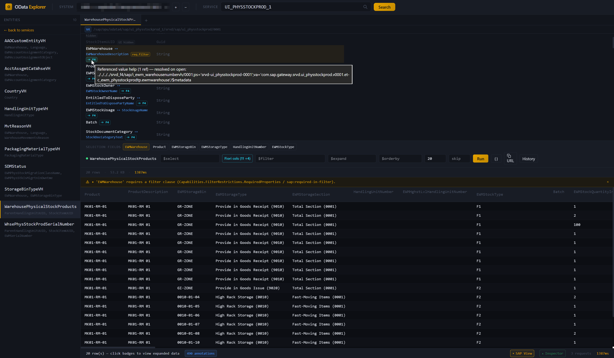

# sap-odata-explorer

> A focused SAP OData explorer for real systems, with catalog discovery, metadata browsing, and query tooling.

[](LICENSE)
[](https://github.com/kts982/sap-odata-explorer/actions/workflows/ci.yml)
[](https://rustup.rs)
[](#)



A CLI tool and desktop app for exploring and testing SAP OData services against real customer systems. It supports **OData V2 and V4**, SAP Gateway catalog discovery, and three common authentication modes: basic auth, Windows SSO (Kerberos / SPNEGO), and browser-based SSO (Azure AD / SAP IAS / SAML flows).

> [!NOTE]
> Early-stage project. Core workflows work end-to-end on real SAP systems, but packaging, docs, and polish are still evolving.
>
> This is an independent project and is not affiliated with, endorsed by, or sponsored by SAP SE.

## Why

Working with SAP OData often means choosing between SAP-native tools that are awkward to use and generic API clients that do not understand SAP conventions.

- **SAP Gateway Client** (`/IWFND/GW_CLIENT`) is useful, but dated and tied to a single SAP session.
- **Postman / Insomnia / Bruno** are strong general-purpose API clients, but they do not know about SAP CSRF handling, `sap-client`, Gateway catalogs, or OData V4 service discovery.
- **SAP Business Accelerator Hub** is useful for standard SAP APIs, not for customer-specific services behind real SAP landscape authentication.
- **SAP Business Application Studio** is a full cloud IDE, not a focused OData exploration tool.

This project is aimed at a narrower problem: understand a real SAP OData service quickly, query it safely, and move on.

## Features

- **Service discovery** — browse V2 and V4 services from SAP Gateway catalogs with search
- **Entity explorer** — inspect entity sets, properties, keys, navigation properties, and labels
- **Visual query builder** — build `$select`, `$expand`, `$filter`, `$orderby`, `$top`, and `$skip` interactively
- **Results grid** — view tabular results with expandable nested data from `$expand`
- **HTTP inspector** — per-tab request/response trace in the desktop app (headers, body preview, timing) with copy-as-curl; same data on the CLI via `--verbose`
- **SAP-aware error hints** — 404/403/5xx responses get actionable hints pointing at `/IWFND/MAINT_SERVICE`, `/IWFND/ERROR_LOG`, `ST22`, or the browser SSO sign-in flow when appropriate
- **SAP View** — opt-in overlay that reads a service's SAP/UI5 annotations and renders the explorer as a Fiori-aware view: Fiori-ordered columns, filter chips, value-help (F4) pickers, restriction validation. Toggle from the status bar. See [docs/SAP-VIEW.md](./docs/SAP-VIEW.md) for the full annotation list.
- **Fiori-readiness linter** — evaluates a service's annotations against a Fiori list-report / object-page checklist: profile-aware (list-report / object-page / value-help / analytical / transactional), catches dangling `Path` references, and emits **ABAP CDS fix hints** pointing at the source annotation. Severity levels filter the output. Available in the CLI (`sap-odata lint`) and the desktop describe panel.
- **Connection profiles** — save SAP systems and store Basic-auth passwords in the OS keyring
- **Three auth modes** — basic auth, Windows SSO (SPNEGO), and browser SSO
- **Service aliases** — use short names for long service paths
- **Auto resolution** — type `API_WAREHOUSE_2` and resolve it from the catalog
- **Tabs** — keep multiple independent workspaces open, each with its own profile, service, and trace
- **Favorites and history** — star services (full object cached locally so they appear instantly on profile switch) and replay recent queries
- **Copy helpers** — copy rows, columns, generated query URLs, request/response bodies, or curl commands
- **Filter helper** — click a cell value to turn it into a filter
- **Local-first** — single-binary CLI and desktop app, no server component, no runtime dependencies (Windows / Linux / macOS source builds)

## Installation

Until the first GitHub release is published, build from source — see [CONTRIBUTING.md](CONTRIBUTING.md). Pre-built unsigned binaries will be attached to GitHub releases once tagged.

> [!WARNING]
> Windows SmartScreen may show an "unrecognized app" warning when launching unsigned releases downloaded from the internet. Click **More info → Run anyway**. Reputation and/or code signing is planned.

## Quick start

### Desktop app

1. Launch `sap-odata-explorer-app.exe`
2. Click `+` next to the profile dropdown to add a system
3. Choose auth mode and save the profile
4. For Browser SSO profiles, click **Sign In** once and complete the login flow
5. Click **Search** to browse services and pick one
6. Click an entity set in the sidebar → click property names to add them to `$select`, navigation properties to `$expand` → **Run**
7. Toggle **SAP View** in the status bar to overlay SAP/UI5 annotation hints (entity titles, description pairings, criticality colors, filter restrictions, selection-field chips). Toggle **Inspector** to see the full HTTP trace for the last call.

### CLI

```bash
# Easiest path: guided setup
sap-odata setup

# Then browse and query
sap-odata -p DEV services -f warehouse
sap-odata -p DEV -s API_WAREHOUSE_2 entities
sap-odata -p DEV -s API_WAREHOUSE_2 describe Warehouse
sap-odata -p DEV -s API_WAREHOUSE_2 run Warehouse --top 5

# Any command with --verbose prints the full HTTP trace to stderr
# (same data as the desktop app's Inspector, with auth headers redacted).
sap-odata -v -p DEV -s API_WAREHOUSE_2 run Warehouse --top 1
```

If you prefer scripted setup, `sap-odata profile add ...` is still available for direct profile creation.

## CLI commands

| Command | Purpose |
|---|---|
| `setup` | Interactive wizard to add a new SAP system |
| `signout <profile>` | Clear persisted Browser SSO session |
| `profile list/add/remove/test/where` | Manage saved SAP systems |
| `alias add/list/remove` | Per-profile short names for services |
| `services` | List available OData services from the catalog |
| `entities` | List entity sets in a service |
| `describe <set>` | Show properties, keys, nav properties, labels |
| `functions` | List function imports / actions |
| `build <set> [query]` | Dry-run: print the OData URL, no HTTP call |
| `run <set> [query]` | Execute query, show results as table |
| `metadata` | Dump raw `$metadata` XML |
| `lint [<entity>]` | Fiori-readiness checklist — check a service's annotations against list-report / object-page expectations, with ABAP CDS fix hints. `--min-severity pass\|warn\|miss` to filter. |
| `annotations` | List every SAP/UI5 annotation parsed from `$metadata`, grouped by vocabulary. `--namespace` / `--filter` to narrow. |

See [CLI-REFERENCE.md](docs/CLI-REFERENCE.md) for all options (or run `sap-odata <command> --help`).

## Authentication

- **Basic** — username/password, stored in the OS keyring by default
- **Windows SSO** — SPNEGO/Kerberos via Windows SSPI, with no password prompt on supported domain-joined machines
- **Browser SSO** — for SAP systems behind SAML-style login chains such as Azure AD or SAP IAS; sign-in happens in the desktop app and the resulting session can be reused by the CLI

### Setup wizard

The CLI has an interactive wizard for adding profiles:

```bash
sap-odata setup
```

This walks through profile name, URL, client, language, auth method, and credentials where needed. For Basic and Windows SSO profiles it can also test the connection immediately.

For Browser SSO, the wizard saves the profile, but the first interactive sign-in happens from the desktop app. After that, the CLI reuses the persisted session automatically.

### Persisted browser SSO sessions

For Browser SSO profiles, the desktop app and CLI work together:

1. Create the profile with `sap-odata setup` or from the desktop app.
2. In the desktop app, click **Sign In** once and complete the IdP flow.
3. The session is stored in the OS keyring under the current user account.
4. Subsequent CLI commands reuse that session automatically until it expires.

Typical flow:

```bash
sap-odata -p PRD services
sap-odata -p PRD -s API_X run ...

# Clear the persisted CLI session:
sap-odata signout PRD
```

The desktop app also has a **Sign Out** button for Browser SSO profiles. That clears the persisted session and local webview cookies for SAP and common IdP hosts.

Sessions still expire server-side. When that happens, the CLI tells you to sign in again from the desktop app. If a profile's `base_url`, `client`, or `language` changes, any persisted Browser SSO session is treated as stale and discarded automatically.

## Security notes

- **TLS verification** is enabled by default. For self-signed SAP certificates, set `insecure_tls = true` in the profile's `connections.toml`.
- **Passwords** are stored in the OS keyring (Windows Credential Manager / macOS Keychain / Linux Secret Service) by default rather than in plaintext config.
- **Browser SSO session cookies** are serialized, compressed, and stored in the OS keyring under the current user account. The risk profile is similar to a browser persisting auth cookies locally.
- **Sign-out behavior** is explicit: `sap-odata signout <profile>` clears the persisted Browser SSO session; the desktop app's **Sign Out** also clears local webview cookies for SAP and common IdP hosts.
- **CSP** is enforced in the Tauri app; assets are bundled locally and not loaded from external CDNs.

## Responsible use

Use this tool only with SAP systems and endpoints you are authorized to access. SAP's [API Policy](https://www.sap.com/documents/2026/04/dce9aee4-497f-0010-bca6-c68f7e60039b.html) distinguishes published/documented APIs from internal or private interfaces and describes API controls for availability, limits, security, bulk extraction, and automated use.

`sap-odata-explorer` is intended for human-driven inspection and testing of documented SAP OData services or customer-owned services. It is not intended to bypass SAP API controls, access internal/private SAP APIs, perform large-scale data extraction, or act as an autonomous API-calling agent.

## How it compares

The short version: other tools treat an SAP OData service as generic REST. This one reads the SAP/UI5 annotations that come with the service, renders results the way a Fiori app would, and flags Fiori-readiness gaps with ABAP CDS fix hints.

| Tool | Where it fits |
|---|---|
| **SAP Gateway Client** | Better suited to backend QA replay inside SAP. `sap-odata-explorer` runs cross-platform, discovers V2+V4 catalogs, overlays a Fiori-aware view from the service's own UI5 annotations (column order, filter chips, F4 pickers, `Capabilities.*` restrictions), and **lints** for Fiori-readiness with ABAP CDS fix hints — GW Client shows the raw OData response. |
| **SAP Business Accelerator Hub** | Better suited to official SAP API browsing and SDK downloads. `sap-odata-explorer` works against live customer systems and custom services, with annotation-driven rendering and a Fiori-readiness linter — things reference docs can't provide. |
| **Postman / Insomnia / Bruno / Hoppscotch** | Better suited to broad API workflows, collections, and collaboration. `sap-odata-explorer` is focused on SAP specifics — CSRF handling, `sap-client`, Gateway catalog discovery — reads UI5 annotations to render results the way a Fiori app would, and lints annotations for dangling references and missing Fiori expectations. Generic HTTP clients don't attempt any of this. |

*The CLI is scriptable by design (stable subcommands, exit codes, `--verbose` trace output) and composes cleanly with shell pipelines, CI steps, or external wrappers — so while the tool is aimed at human-driven exploration, nothing stops you from invoking it from higher-level automation when that's what you need.*

**Best fit:** *"I need to quickly understand and query this SAP OData service."*

## Project structure

```
sap-odata-explorer/
├── crates/
│   ├── core/       # Shared library (auth, HTTP, metadata, query, catalog, config, SSO)
│   └── cli/        # CLI binary
└── tauri-app/
    ├── src/        # Frontend (HTML + Tailwind + vanilla JS)
    └── src-tauri/  # Tauri commands wrapping core
```

The `sap-odata-core` crate holds all protocol logic. CLI and Tauri are thin wrappers. This makes it easy to add a third frontend later (MCP server, web app, etc.).

## Directions

Not a commitment — priorities may shift. Open issues track current focus.

Legend: `[x]` done · `[-]` partial / in progress · `[ ]` planned

- [-] Auth validation on federated landscapes (Azure AD tested on some configurations; SAP IAS, Okta, ADFS still to go)
- [ ] V2 F4 convention scan (`sap:value-list` → infer `*_VH` entity set → drive the picker)
- [ ] Code signing and release pipeline (CI builds for Windows / Linux / macOS, signed Windows artifacts)

## Contributing

See [CONTRIBUTING.md](CONTRIBUTING.md). Bug reports, PRs, and discussions welcome.

## License

MIT — see [LICENSE](LICENSE).
