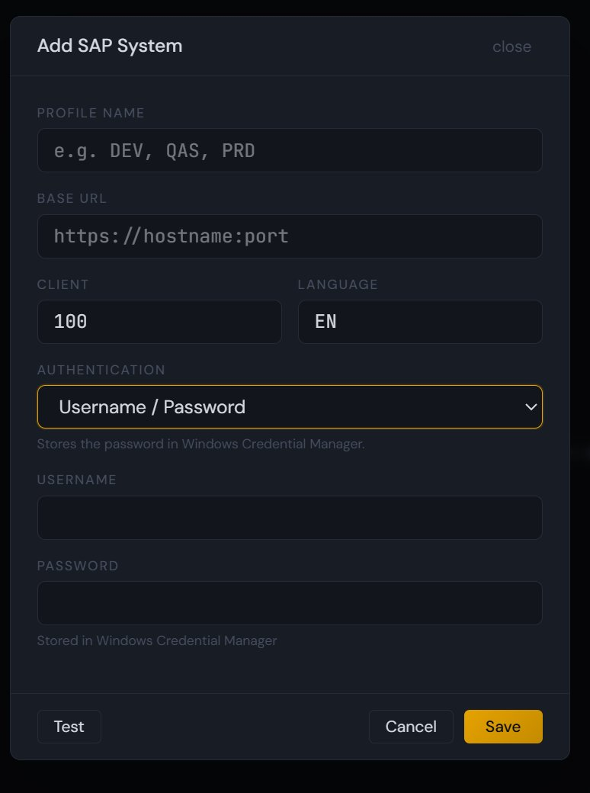
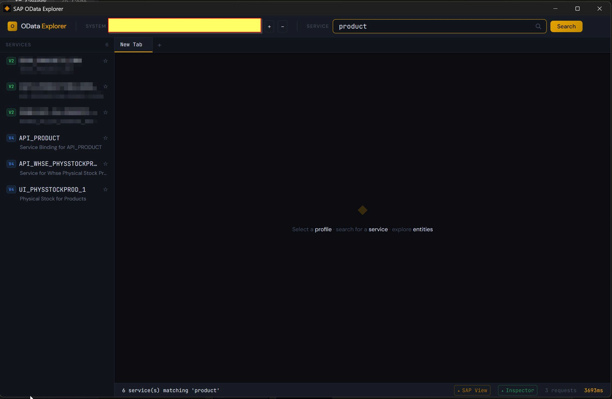
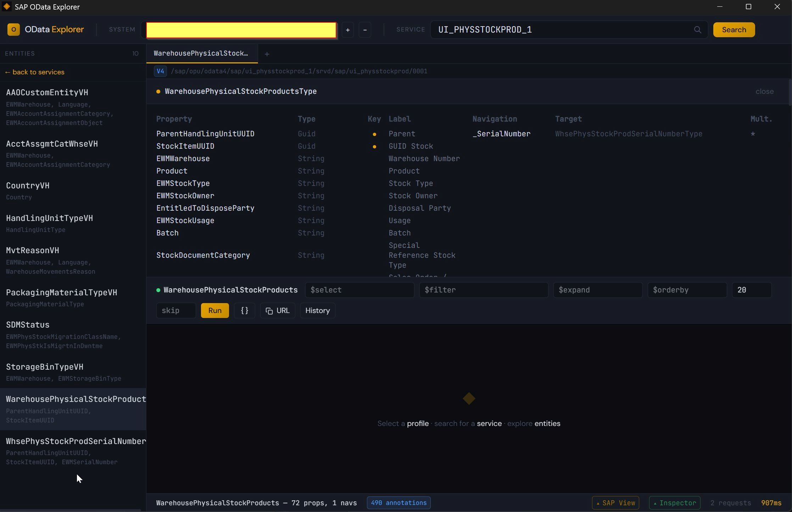
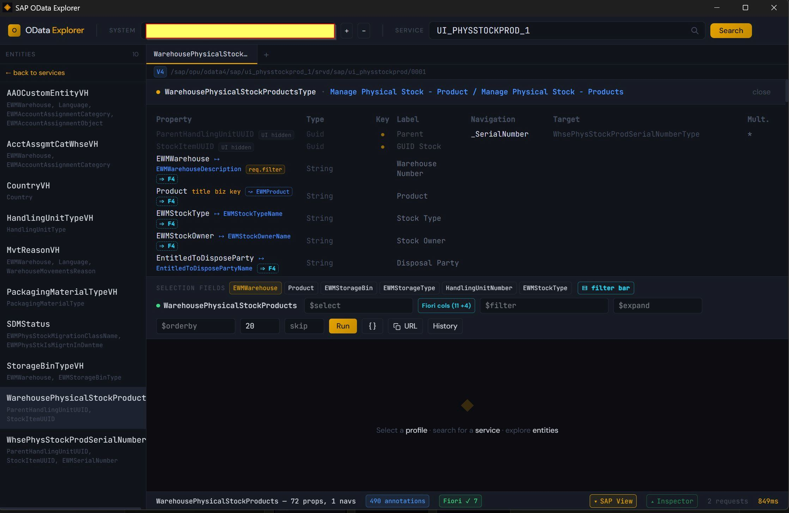
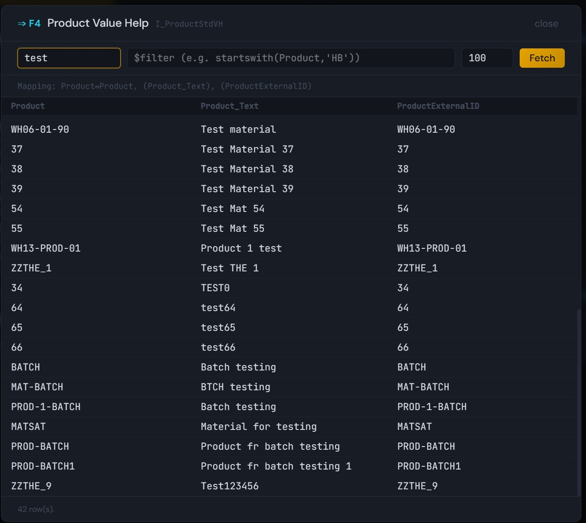
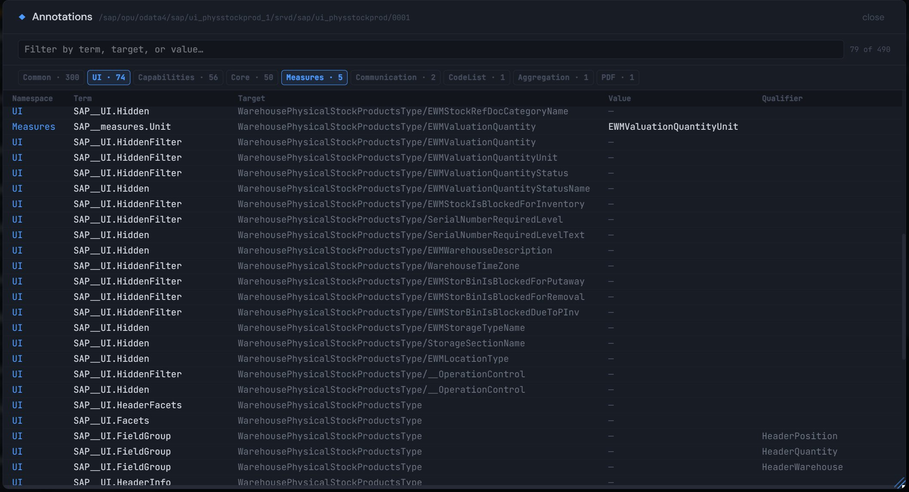
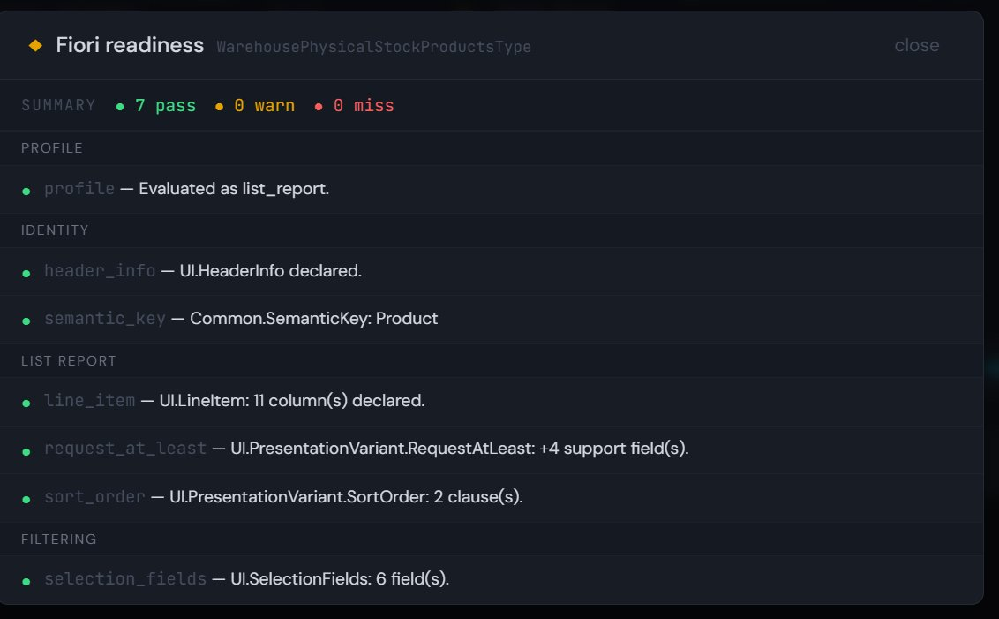
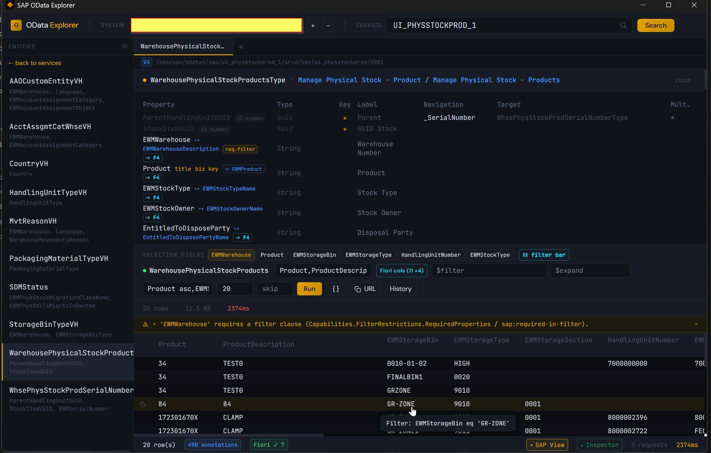

# Showcase

Visual tour of `sap-odata-explorer` against a real SAP OData service. The path: connect a system → find a service → inspect an entity → run a query — with the **SAP View** annotation overlay on so the explorer behaves like a stack-bridge between ABAP backend and Fiori frontend, not a generic OData client.

System names and customer-internal service IDs are redacted; the entity, property, and annotation content is from SAP-shipped services.

For deeper reference on each surface:

- [SAP-VIEW.md](./SAP-VIEW.md) — full SAP View annotation coverage table, deliberate gaps, design rationale
- [CLI-REFERENCE.md](./CLI-REFERENCE.md) — every CLI command and flag

## 1. Connect a system

Profile-first auth: name a system once (e.g. `DEV` / `QAS` / `PRD`), and the explorer remembers it across CLI and desktop. Username/password is stored in Windows Credential Manager — never in config. Browser SSO is the alternative for federated landscapes (Azure AD, SAP IAS, Okta, ADFS).

## 2. Discover services

Catalog search across V2 and V4 services in one list — `V2` and `V4` badges differentiate at a glance. Service descriptions surface SAP's published label so naming patterns (`API_*`, `UI_*`, customer `Z*` prefixes) aren't your only signal.

## 2b. The raw OData baseline

With **SAP View** off, the explorer behaves like `/IWFND/GW_CLIENT`: property names, types, keys, navigation targets — nothing more. Useful when you want raw metadata truth and nothing else.

## 3. SAP View — the annotation overlay

Toggle **SAP View** in the status bar and the same entity reshapes itself:

- `Common.Text` companions fold in as `→ DescriptionProp` markers next to the code column
- `Common.SemanticKey` properties get amber `biz key` tags so you can find the *business* key in a sea of UUIDs
- `UI.Hidden` / `UI.HiddenFilter` properties dim or pill out
- Value-help-bearing properties get an `⇒ F4` marker (solid for inline `Common.ValueList`, dashed for `Common.ValueListReferences`)
- A **Selection Fields** chip bar above `$filter` lets you populate the filter from `UI.SelectionFields` with one click; required-in-filter chips render amber
- **Fiori cols (N +M)** populates `$select` from `UI.LineItem` + `UI.PresentationVariant.RequestAtLeast`, and `$orderby` from declared sort order — what a Fiori list report would show by default

Every annotation effect is opt-in behind a single toggle. Default off keeps the raw flow untouched.

## 4. F4 value-help picker

Click `⇒ F4` on any property to open the picker against the referenced value-help service. Supports:

- **Inline `Common.ValueList`** mappings (solid marker)
- **`Common.ValueListReferences`** (dashed marker) — relative URL resolved against the current service path, F4 metadata fetched and parsed on open, cached per reference URL
- **`$search`** when the active mapping or the resolved F4 service declares `SearchSupported=true` / `Capabilities.SearchRestrictions.Searchable=true`
- **Multi-variant pill bar** when the property has multiple qualifiers or multiple reference URLs

On pick, `InOut`/`Out` parameters write `local_property eq <literal>` clauses back into the main `$filter`, quoted per the local property's `edm_type`.

## 5. Raw annotation inspector

The footer annotation badge (`N annotations`) is clickable — it opens a modal that lists every annotation the parser captured, beyond what the typed views surface. Namespace chips filter by vocabulary (`UI · 74`, `Common · 300`, `Capabilities · 56`, …); the search box matches across term, target, value, and qualifier.

Useful for *"does this service declare X?"* spelunking and for verifying that a CDS annotation actually round-tripped into `$metadata`.

Same data on the CLI via `sap-odata annotations`.

## 6. Fiori readiness linter

Profile-aware Fiori-readiness checker. Auto-detects the entity's shape (list-report / object-page / value-help / analytical / transactional) from name conventions and declared annotations, then adjusts the checks — a value-help entity never gets dinged for missing `UI.LineItem` because that's not its job.

Checks cover:

- **Identity** — `UI.HeaderInfo`, `Common.SemanticKey` (warns if the technical key looks UUID-ish and no business key is declared)
- **List-report** — `UI.LineItem`, `UI.PresentationVariant`
- **Filtering** — `UI.SelectionFields`, `UI.SelectionVariant`
- **Consistency** — `SelectionFields` referencing a non-filterable property, `SortOrder` against a non-sortable column, `UI.Hidden` inside `SelectionFields`, `ValueList` without an `Out`/`InOut` parameter, `TextArrangement` without a `Common.Text` to arrange, `SemanticObject` without `SemanticKey`
- **Integrity** — `Common.Text`, `Measures.Unit`, `Measures.ISOCurrency`, `UI.Criticality` (Path form), `UI.HeaderInfo.Title`, `Common.SemanticKey`, `UI.SelectionFields`, `UI.LineItem`, `UI.PresentationVariant.SortOrder` pointing at columns that don't exist on the entity. Typical cause: a column renamed in one CDS layer without the annotation being propagated.

Each finding ships with an ABAP CDS fix hint and a one-line "what Fiori does with it" explanation — the linter teaches rather than just grades. Same on the CLI via `sap-odata lint`.

## 7. Pre-flight validator on the results grid

Every query is cross-checked against the service's declared restrictions before it runs. Violations show as an amber strip above the results — the query **still runs** (the server is the source of truth), but you see what the service thinks will fail.

Visible here: the service declares `EWMWarehouse` as required-in-filter via `Capabilities.FilterRestrictions.RequiredProperties`; the query was sent without it; the strip names the missing column.

The results grid also reshapes per SAP View:

- Columns follow `UI.LineItem` declared order, position-first
- Cells fold text companions per `UI.TextArrangement` (`TextFirst` / `TextLast` / `TextOnly` / `TextSeparate`)
- `UI.Criticality` colors render as cell-level dots — `Fixed` paints uniformly, `Path` reads the numeric code from the companion column per row
- Click any cell to add an `eq` clause to `$filter`; the raw underlying value is preserved separately from the displayed format

---

**Not shown:** the `sap-odata` CLI mirrors most of the surfaces above. See [CLI-REFERENCE.md](./CLI-REFERENCE.md) for `describe`, `entities`, `run`, `annotations`, `lint`.
